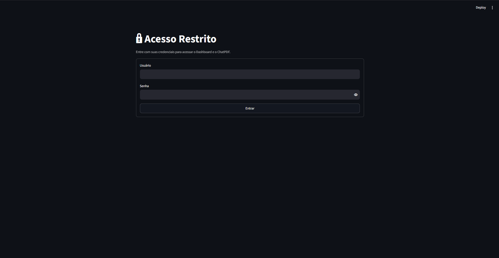
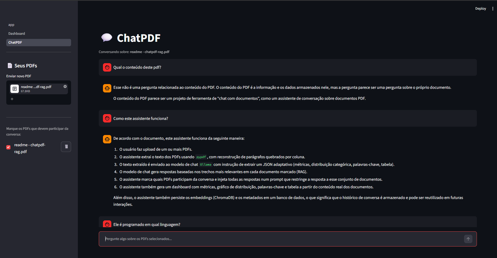
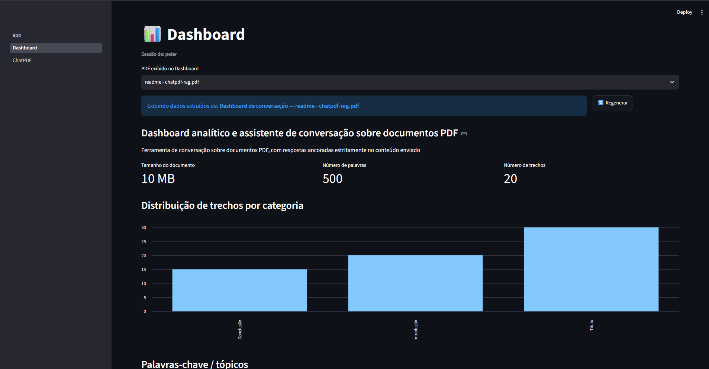

# chatpdf-rag

🇧🇷 Português | 🇺🇸 [English](README.en.md)

[](LICENSE)
[](https://www.python.org/)

Dashboard analítico e assistente de conversação sobre documentos PDF, rodando
100% localmente com [Ollama](https://ollama.com) — nenhum dado sai da máquina,
nenhuma API de nuvem envolvida.

Faça upload de um ou mais PDFs, converse com eles com respostas ancoradas
estritamente no conteúdo enviado, e veja um dashboard gerado automaticamente a
partir do que cada documento contém — sem esquema fixo, adaptado ao tipo de
conteúdo de cada arquivo.

## Capturas de tela

<p align="center">
  
  
  
</p>

## Por quê

Ferramentas de "chat com documentos" em nuvem exigem enviar o conteúdo para
servidores de terceiros — inconveniente para currículos, contratos, material
institucional ou qualquer documento sensível. Este projeto roda inteiramente na
sua máquina: extração, embeddings, busca semântica e geração de resposta, tudo
via Ollama local.

## Como funciona

1. **Upload** — o PDF é salvo em `data/uploads/` e o texto extraído com `pypdf`,
   com reconstrução de parágrafos quebrados por coluna (comum em documentos
   acadêmicos e institucionais em duas colunas).
2. **Indexação** — o texto é dividido em chunks com sobreposição, embeddings
   são gerados via `nomic-embed-text` e persistidos em uma coleção dedicada no
   [ChromaDB](https://www.trychroma.com/) (`data/chroma_db/`).
3. **Resumo estruturado** — em paralelo, o texto completo é enviado ao modelo
   de chat com instrução de extrair um JSON adaptativo (métricas, distribuição
   categórica, palavras-chave, tabela) — sem assumir um tipo fixo de documento.
   Esse resumo alimenta o Dashboard.
4. **Conversa com múltiplos documentos** — o usuário marca quais PDFs
   participam da conversa. Cada pergunta busca os trechos mais relevantes em
   cada documento marcado (RAG), rotula a origem de cada trecho, e injeta tudo
   num prompt que restringe a resposta a esse conjunto de documentos.
5. **Persistência** — tanto os embeddings (ChromaDB) quanto os metadados
   (nome, texto extraído, resumo) sobrevivem a reinícios do processo. Nada
   precisa ser reenviado.

## Requisitos

- Python 3.10+
- [Ollama](https://ollama.com/download) instalado e rodando
- Um modelo de chat (ex: `llama3.2`) e o modelo de embeddings:
  ```bash
  ollama pull llama3.2
  ollama pull nomic-embed-text
  ```

## Instalação

```bash
git clone https://github.com/PGC13/chatpdf-rag.git
cd chatpdf-rag

python -m venv .venv
source .venv/bin/activate      # Windows: .venv\Scripts\Activate.ps1

pip install -r requirements.txt

cp .streamlit/secrets.toml.example .streamlit/secrets.toml
# edite usuário/senha reais dentro do arquivo
```

## Uso

```bash
streamlit run app.py
```

1. Faça login (credenciais definidas em `.streamlit/secrets.toml`).
2. Em **ChatPDF**, envie um ou mais PDFs. Marque (☑️) quais devem participar
   da conversa atual — pode ser um só ou vários simultaneamente.
3. Pergunte livremente. As respostas ficam restritas ao conteúdo dos PDFs
   marcados; perguntas fora desse escopo são recusadas.
4. Em **Dashboard**, escolha (dropdown) qual PDF visualizar. Métricas, gráfico
   de distribuição, palavras-chave e tabela são gerados a partir do conteúdo
   real daquele documento — o botão **Regenerar** reprocessa o resumo sob
   demanda.
5. Exclua um PDF (🗑️) a qualquer momento — remove o arquivo, o índice
   vetorial e os metadados, sem deixar rastro em disco.

## Estrutura do projeto

```
chatpdf-rag/
├── app.py                       # login (ponto de entrada)
├── pages/
│   ├── 1_Dashboard.py           # dashboard adaptativo por documento
│   └── 2_ChatPDF.py             # upload, seleção múltipla, exclusão e chat
├── utils/
│   ├── auth.py                  # checagem de credenciais
│   ├── pdf_processing.py        # extração de texto + chunking
│   ├── vector_store.py          # embeddings + ChromaDB (persistido em disco)
│   ├── pdf_registry.py          # metadados dos PDFs + hidratação de sessão
│   └── pdf_insights.py          # extração adaptativa de resumo (JSON) via LLM
├── modelfiles/                  # Modelfiles Ollama opcionais (ver abaixo)
├── data/uploads/                 # PDFs enviados + metadados (gerado em runtime)
├── data/chroma_db/                # índice vetorial persistido (gerado em runtime)
├── .streamlit/secrets.toml.example
└── requirements.txt
```

Ver [`ARCHITECTURE.md`](ARCHITECTURE.md) para o detalhamento técnico de cada módulo e as
decisões de arquitetura por trás deles.

## Modelos customizados (opcional)

O diretório `modelfiles/` define dois modelos Ollama derivados do modelo base,
com parâmetros ajustados para cada papel específico no sistema:

| Modelfile | Modelo gerado | Papel | Ajuste principal |
|---|---|---|---|
| `Modelfile.chat` | `chatpdf-assistant` | Conversação sobre o PDF | `temperature 0.3`, `num_ctx 8192` (contexto ampliado para os chunks recuperados) |
| `Modelfile.insights` | `chatpdf-insights` | Extração de dados para o Dashboard | `temperature 0.05`, sem `seed` fixo (preserva a utilidade do botão Regenerar) |

Build:

```bash
ollama create chatpdf-assistant -f modelfiles/Modelfile.chat
ollama create chatpdf-insights  -f modelfiles/Modelfile.insights
```

Sem esse passo, o app funciona normalmente usando o modelo base puro. Detalhes
da escolha de cada parâmetro em [`modelfiles/README.md`](modelfiles/README.md).

## Limitações

- **Autenticação de usuário único** — adequado para uso pessoal, não para
  múltiplas contas com senhas próprias (ver Roadmap).
- **PDFs escaneados (imagem) não são suportados** — requer OCR, que não está
  incluído.
- **Extração de insights não é determinística** — por depender de um LLM, duas
  execuções sobre o mesmo documento podem produzir métricas ligeiramente
  diferentes. O botão Regenerar existe para dar uma nova tentativa quando isso
  ocorre.
- **Histórico de conversa não é persistido** — reiniciar o processo limpa o
  chat, mas mantém os documentos indexados e seus resumos.
- **Contexto cresce com o número de PDFs marcados** simultaneamente na
  conversa — respostas tendem a ficar mais lentas com muitos documentos
  selecionados ao mesmo tempo.

## Roadmap

- [x] Persistência de embeddings e metadados em disco (ChromaDB)
- [x] Conversa com múltiplos PDFs simultâneos, com atribuição de origem
- [x] Dashboard com schema adaptativo (sem assumir tipo de documento)
- [x] Modelos Ollama customizados via Modelfile
- [ ] Múltiplos usuários com autenticação própria (`streamlit-authenticator`)
- [ ] Detecção de tipo de documento como etapa separada, permitindo schemas
      fixos para casos conhecidos (ex: currículos) com fallback adaptativo
- [ ] Suporte a OCR para PDFs escaneados
- [ ] Pré-processamento opcional via [`pdf-translator`](https://github.com/PGC13/pdf-translator)
      para documentos em outro idioma
- [ ] Persistência do histórico de conversa

## Contribuindo

Sugestões, correções e pull requests são bem-vindos. Abra uma issue descrevendo
o problema ou a melhoria antes de submeter mudanças maiores.

## Licença

MIT — veja [LICENSE](LICENSE).
